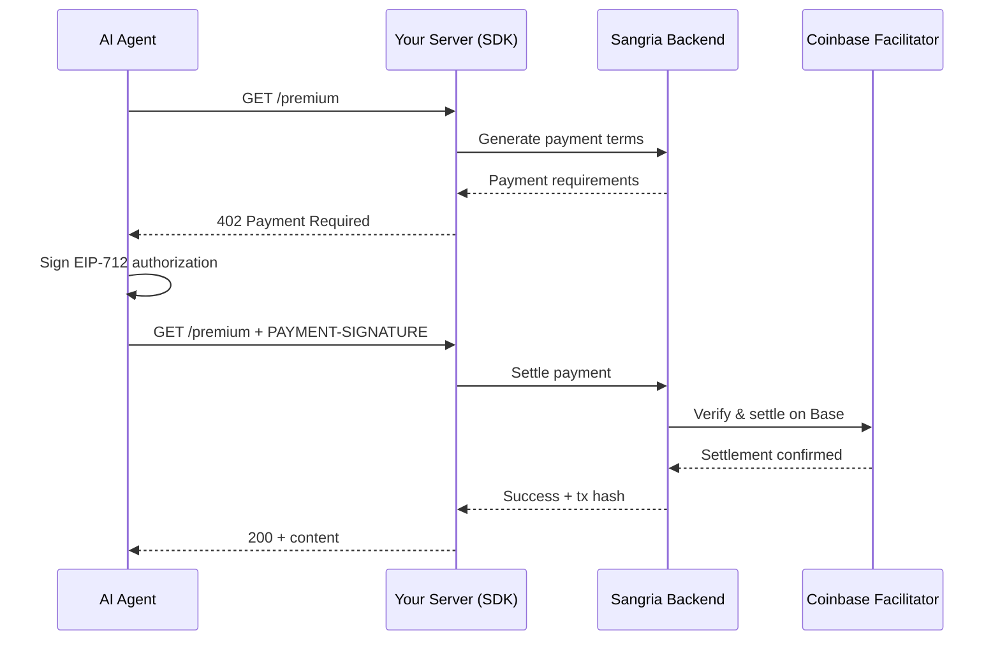

<p align="center">
  
</p>

<p align="center">
  <strong>Let Agents pay for your API (in ~3 lines of code)</strong>
</p>

---

## Quick Start

### TypeScript (Express)

```bash
pnpm add @sangrianet/core express
```

```typescript
import express from "express";
import { SangriaNet } from "@sangrianet/core";
import { fixedPrice } from "@sangrianet/core/express";

const app = express();
const sangria = new SangriaNet({ apiKey: process.env.SANGRIA_SECRET_KEY! });

app.get(
  "/premium",
  fixedPrice(sangria, { price: 0.01, description: "Premium content" }),
  (req, res) => {
    res.json({ data: "premium content", tx: req.sangrianet?.transaction });
  }
);

app.listen(3000);
```

### Python (FastAPI)

```bash
pip install sangria-merchant-sdk[fastapi]
```

```python
from fastapi import FastAPI, Request
from sangria_sdk import SangriaMerchantClient
from sangria_sdk.adapters.fastapi import require_sangria_payment

app = FastAPI()
client = SangriaMerchantClient(api_key=os.environ["SANGRIA_SECRET_KEY"])

@app.get("/premium")
@require_sangria_payment(client, amount=0.01, description="Premium content")
async def premium(request: Request):
    return {"data": "premium content"}
```

**That's it.** Your endpoint now charges $0.01 per request. AI agents pay automatically via the x402 protocol.

---

## Supported Frameworks

| Language | Framework | Adapter Import | 
|---|---|---|
| TypeScript | Express >= 4 | `@sangrianet/core/express` |
| TypeScript | Fastify >= 4 | `@sangrianet/core/fastify` |
| TypeScript | Hono >= 4 | `@sangrianet/core/hono` |
| Python | FastAPI >= 0.135 | `sangria_sdk.adapters.fastapi` |

---

## How It Works



---

## Features

- **Zero gas fees** — Coinbase Facilitator sponsors gas on Base
- **Framework agnostic** — Express, Fastify, Hono, and FastAPI with more coming
- **Conditional bypass** — skip payments for API key users with `bypassPaymentIf` / `bypass_if`
- **Fixed & variable pricing** — `exact` and `upto` payment schemes
- **Double-entry ledger** — internal credit system with idempotent transactions
- **Standards-compliant** — EIP-712 typed signing, ERC-3009 USDC transfers, x402 v2

---

## Project Structure

| Directory | What | Stack |
|---|---|---|
| [`backend/`](backend/) | Orchestration API — accounts, payments, settlement | Go, Fiber, pgx |
| [`dbSchema/`](dbSchema/) | Database schema (single source of truth) | Drizzle ORM |
| [`frontend/`](frontend/) | Documentation site | Next.js, Tailwind |
| [`sdk/sdk-typescript/`](sdk/sdk-typescript/) | TypeScript merchant SDK (`@sangrianet/core`) | TypeScript |
| [`sdk/python/`](sdk/python/) | Python merchant SDK (`sangria-merchant-sdk`) | Python, httpx |
| [`playground/`](playground/) | Example merchants + buyer client | Express, Fastify, Hono, FastAPI |

---

## Documentation

- [TypeScript SDK](sdk/sdk-typescript/README.md) — full API, all framework adapters, bypass config
- [Python SDK](sdk/python/README.md) — FastAPI adapter, API contract
- [Playground](playground/README.md) — run example merchants and test payments locally
- [Backend API](backend/README.md) — API reference, self-hosting guide
- [Architecture](Sangria-Architecture.md) — layered architecture deep-dive
- [Protocol Overview](Sangria-Overview.md) — x402 operations and settlement scenarios
